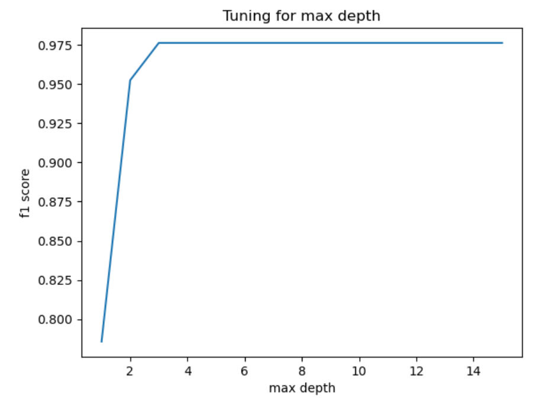

# Course Project1: Machine Learning Algorithm for Disease Classification

This is my submission to MA-204(SML) course project-1.

## Problem

*Complete Dataset consists of 2 CSV files attached in the assignment. One of them is training and other is for testing your model. Each CSV file has 133 columns. 132 of these columns are symptoms that a person experiences and last column is the prognosis. These symptoms are mapped to 42 diseases you can classify these set of symptoms to. You are required to train your model on training data and test it on testing data.*

***Objectives:*** 

- *Used any four supervised ML models and compare their performances.*
- *Apply dimensional reduction technique (PCA) on data and see how the classification accuracy decreases as the dimension is reduced. Plot a graph between classification accuracy and number of PCA features.*
- *Apply Random Forest algorithm and tune the hyper-parameters for getting the best classification accuracy.*

*You need to make a report with links to your code files and returned it to the assignment.*

## Solution

**a.** I will be using the following 4 supervised machine learning algorithms:
  - *Decision Tree Classifier*
  - *Support Vector Classifier(linear)*
  - *Naive Bayes Classifier*
  - *Softmax Regression (multiclass Logistic)*
#### Results
I was able to achieve a classification accuracy of:  

| Classification Algorithm Used |      Accuracy      |
|:-----------------------------:|:------------------:|
|    Decision Tree Classifier   | 97.61904761904762% |
|     Naive Bayes Classifier    |       100.0%       |
|   Support Vector Classifier   |       100.0%       |
|       Softmax Classifier      | 97.61904761904762% |  

**b.** I applied PCA to reduce dimensions from 132 to k. Then plotted the accuracy of each model vs k.
#### Results
Here is the plot I obtained:

**c.** Initially after applying Random Forest Classifier, I obtained a classification accuracy of 97.61904761904762%. Then I tried to tune:
- max_depth
- criterion
- n_estimators
- ccp_alpha
#### Results

| Parameter tuned | Performance vs Value of parameter | Observation                                                                    | Conclusion                               |
|:---------------:|:---------------------------------:|--------------------------------------------------------------------------------|------------------------------------------|
|    max_depth    |          | After a value of 3, accuracy does not substantially increase for higher values | **Optimal value: 3**                     |
|    criterion    |          | gini performed poorly as compared to entropy and log_loss                      | **Optimal value: entropy/log_loss**      |
|   n_estimators  |       | Peaked at value 13, and between 15 and 23                                      | **Optimal value: 19(average of 15, 23)** |
|    ccp_alpha    |          | Kept decreasing for higher values                                              | **Optimal value: 0.0**                   |

Finally, for the results to be deterministic, I had to set a random state. To choose this value, I plotted the accuracies with respect to value and chose *14* as it was one of the peaks.

**I was able to obtain a classification accuracy of *100%* after tuning the parameters**
