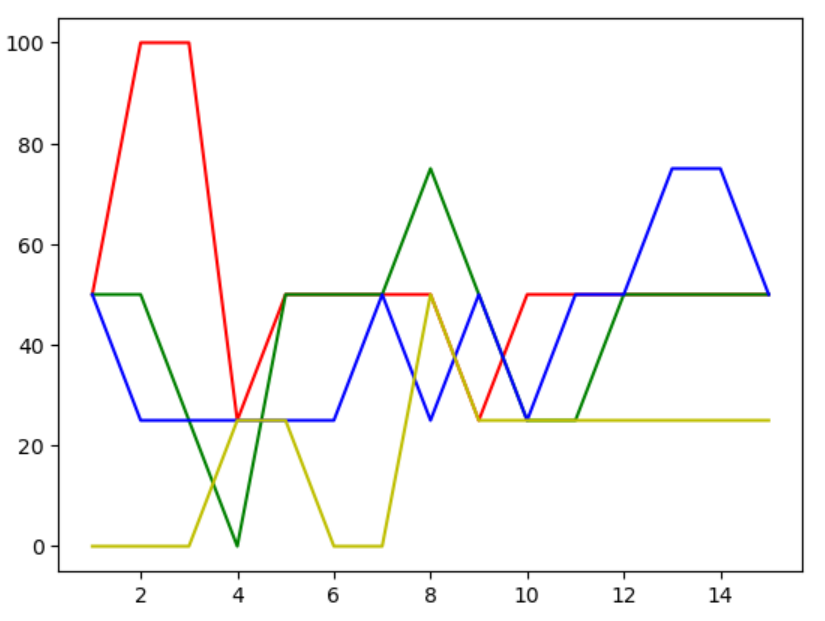
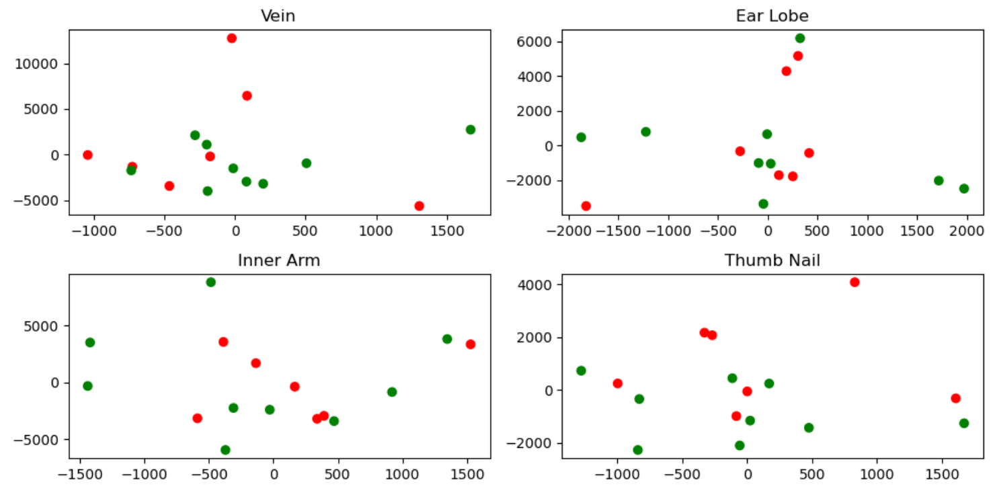

# Course Project2: Raman Spectroscopy of Diabetes

## Problem

Refer to [this](https://www.kaggle.com/codina/raman-spectroscopy-of-diabetes)

## Solution

After applying PCA, I used the following classifiers:
- SVM
- GradBoost
- Voting Classifier
- Bagging Classifier
- Random Forest Classifier

### PCA

I tuned the number of PCA components. Here is what I obtained:  

  

The projections to 2D are:  

  

***Project on hold***