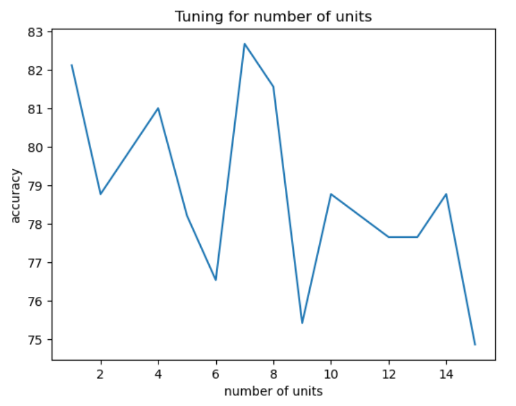
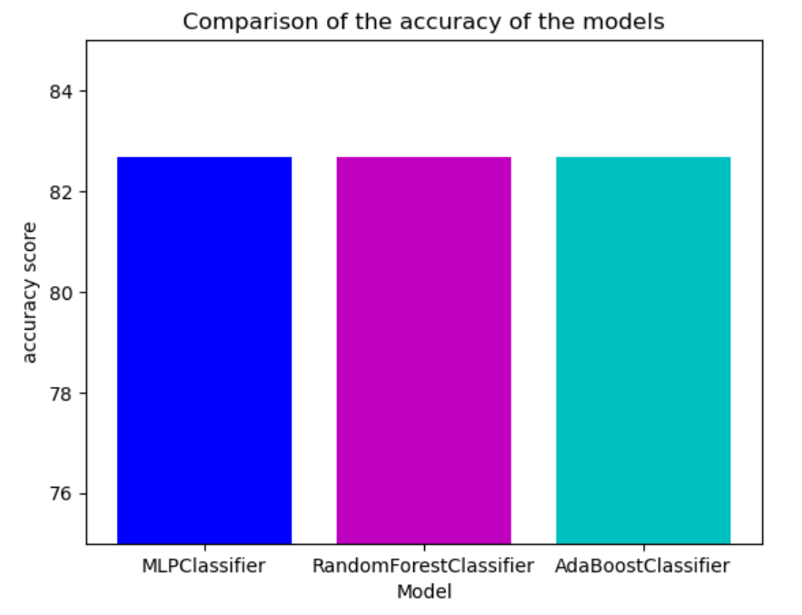

# Course Project3: Titanic Dataset

## Dataset:
*The dataset is the one from the kaggle competion [Titanic: Machine Learning from Disaster](https://www.kaggle.com/c/titanic/data)
The data has been split into two groups: training set (train.csv) and test set (test.csv)*
## Objective:
*The training set should be used to build your machine learning models. For the training set, we 
provide the outcome (also known as the “ground truth”) for each passenger. Your model will be 
based on “features” like passengers’ gender and class. You can also use feature engineering to 
create new features.
The test set should be used to see how well your model performs on unseen data. For the test set, 
we do not provide the ground truth for each passenger. It is your job to predict these outcomes. 
For each passenger in the test set, use the model you trained to predict whether or not they 
survived the sinking of the Titanic.*  
Use the following models and submit a table having comparison results of the
following algorithms:
1. **MLP with one hidden node (no of units you may decide based on trial)**
2. **Random Forest**
3. **Adaptive Boosting**  
*Use best possible set of hyper-parameters for the above algorithm*

## Solution

### Number of units of MLP  
  
To obtain the optimal number of units for the MLP, I plotted the number of units vs accuracy to conclude that **7** was optimal.  

### Comparison Between the Models
  
Here is a comparison of the classification accuracies I obtained:  

| Classification Algorithm Used |      Accuracy      |
|:-----------------------------:|:------------------:|
|         MLP Classifier        | 82.68156424581005% |
|    Random Forest Classifier   | 82.68156424581005% |
|      AdaBoost Classifier      | 82.68156424581005% |

***All the models used performed equally on the test data***