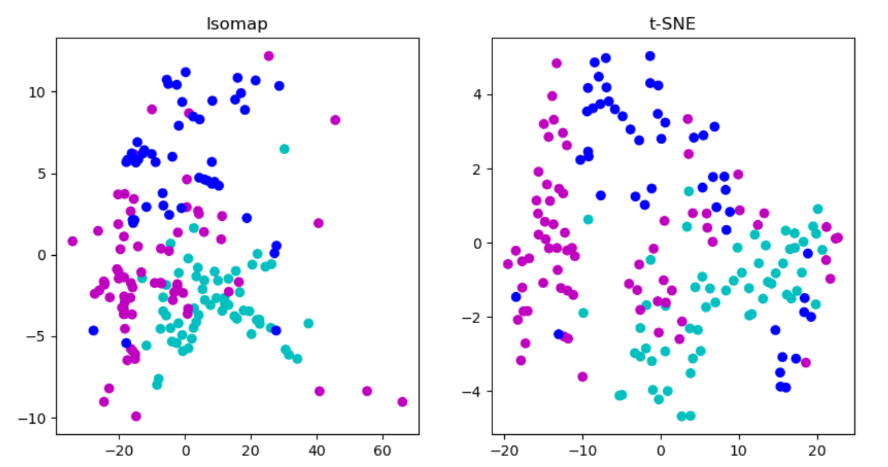

# Course Project4: Manifold Learning with Isomap and t-SNE

This is my submission to MA-204(SML) course project-4.

## Problem

*You are well familiar about nonlinear dimensionality reduction algorithms (ISOMAP and 
tSNE). The objective of this project is to use a Kaggle dataset (except MNIST digit data) and 
apply these two techniques to get an embedding of high-dimensional data into 2D. Plot the 
results with the respective labelling. Share a report with all the plots and a link to google colab 
notebooks of your code*

## Solution

I was able to obtain a an embedding of the 11D wine data into 2D using Isomap and t-SNE. Here are the plots obtained:  
  

